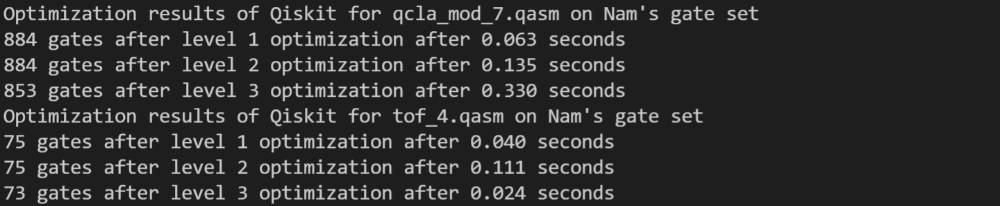
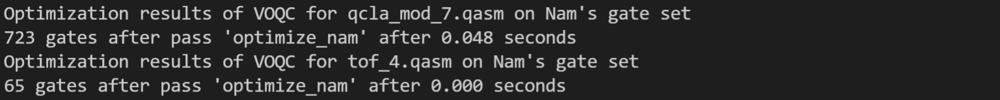
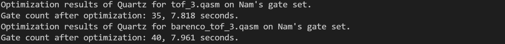
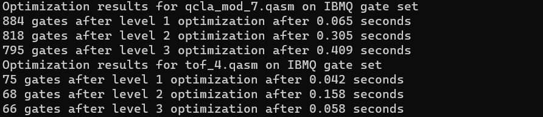
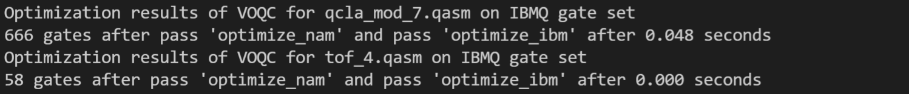
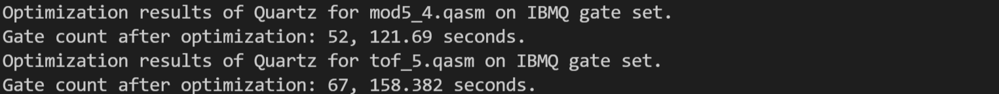
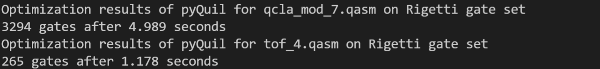
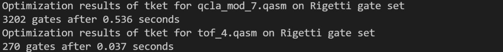
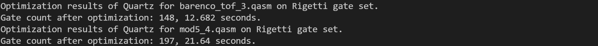

# Artifact for Quartz

[](https://zenodo.org/badge/latestdoi/464661620)

## Getting Started

### Hardware Requirements

We recommend (and only tested) running the artifact on an m6i.32xlarge AWS instance with an Ubuntu 20.04 operating system.
If other devices are used, we require >= 256 GB memory and >= 256 GB storage, and it may take a longer time to run.

### Installation

We provide the following two approaches to install the artifact.

#### 1. Install from AMI

To facilitate the artifact evaluation of our submission, we provide an Amazon Machine Image (AMI) of Quartz with all dependencies pre-installed. Our AMI instance ID is ami-0fb5ae3c79d123cf1. To log in to the instance, the username and password are both `pldi22ae`.

#### 2. Install from source code

We only tested the commands on Ubuntu 20.04, but they should also work on other operating systems.

- Make sure you have CMake (https://cmake.org/) with version >= 3.16.

- Make sure `python` points to `python3`. If not, you can install `python-is-python3`:
  ```shell
  sudo apt-get install python-is-python3
  ```
  
- Install the Z3 Theorem Prover (https://github.com/Z3Prover/z3):
  ```shell
  pip install z3-solver==4.8.12
  ```
  **We require Z3 version 4.8.12.** Please do not use the latest version of Z3 Theorem Prover.

- Run CMake:
  ```shell
  bash run_cmake.sh
  ```

Note that it is not necessary to install Quartz beforehand to run the artifact.

### Install External Packages

Note that you do not need to install external packages if you install from AMI because we have already pre-installed them for you.

If you installed from source, in order to run the experiments related to external packages, you need to install them:

- Qiskit (https://qiskit.org/):
  ```shell
  pip install qiskit
  ```
  Our evaluation uses Qiskit 0.34.2.

- pyvoqc (please follow the instructions on https://github.com/inQWIRE/pyvoqc).

- t|ket⟩ (https://github.com/CQCL/tket):

  ``` shell
  pip install pytket
  ```
  Our evaluation uses pytket 0.16.0.

- pyQuil (https://github.com/rigetti/pyquil):

  ``` shell
  pip install pyquil
  ```
  Our evaluation uses pyquil 3.0.1.

## Table 2: Evaluating the Quartz Generator and the Pruning Techniques

To reproduce the numbers in Table 2, run the following script:

```shell
bash run_table2.sh > table2.log
python show_table2_results.py
```

We present Table 2 in a different way in the camera-ready version than in the submission version of the paper.
We removed the "ECC Simplification" column and added some other columns. This script outputs the numbers
corresponding to the camera-ready version, but the column titles match the submission version for artifact evaluation.
We will modify the script to make the column titles match the camera-ready version when linking the artifact to the
camera-ready version of the paper.

We expect the numbers to differ from the numbers in the submission due to floating-point errors and bug fixes after the
paper submission.

You can run the Python script while the shell script is running to see some intermediate results (a part of the table).
You should be able to see the following intermediate results by running the Python script after running the shell script 1 minute:
```
- Nam Gate Set:
  - Row "n = 3":
    - Column "Original": 11404 (4179)
    - Algorithm 1 with only singleton removal (not shown in the submission): 1180 (566)
    - Column "Representative": 231 (99)
    - Column "Common Subcircuit": 164 (66)
    - Column "Overall Reduction": 98.56% (98.42%)
    - |Rn| (not shown in the submission): 4179
    - Verification time (s) (not shown in the submission): 2.575
    - Column "Running Time (s)": 3.721
  - Row "n = 4":
    - ...
```
The 5 rows with "`- Column`" correspond to 5 cells of the row "n = 3" of "Nam Gate Set" in Table 2.

This script runs for about (TODO) hours. To only reproduce the running time for the generator and verifier with all pruning
techniques faster, you can modify the fourth last argument for each invocation of `test_pruning` in `src/test/test_pruning.cpp`
from `true` to `false`, and then run `bash run_table2.sh`.

## Characteristics and the Number of Transformations for the Three Gate Sets

To reproduce the characteristics at the end of section 4 in the submission, run the following script:

```shell
bash gen_ecc_set.sh
```

In the output, `*** ch(...) = ...` denotes the characteristics for each gate set.

`*** Number of transformations of ... = ...` denotes the number of transformations for each gate set. We expect the
numbers of transformations to differ from the numbers in the submission due to floating-point errors and bug fixes after the submission.

The generated ECC Sets are stored in Json files with file name formatted like
this: `{Gate set name}_{number of gates}_{number_of qubits}_complete_ECC_set.json`.

## Table 3: Comparing Quartz with existing quantum circuit optimizers on Nam's gate set {𝑅𝑧(𝜆),𝑋,𝐻,𝐶𝑁𝑂𝑇}

### The results of Qiskit

To reproduce the results of Qiskit on Nam's gate set, run the following script:

``` shell
python Qiskit_nam.py
```

The results will be shown in the console. The figure below shows part of the results as an example:



As the figures shows, for each circuit, we run Qiskit with optimization levels 1, 2, 3, respectively. We choose the minimum gate count among the 3 optimization levels as the final result.

It is worth noting that optimizations in Qiskit involves some non-determinism, which means that the results may vary among different runs of the optimizations.

### The results of Nam

We refer the results of Nam on Nam's gate set to the paper "A verified optimizer for Quantum circuits" (https://dl.acm.org/doi/10.1145/3434318). Specifically, the results can be found at Table 2, column "Nam(H)" in this paper.

### The results of VOQC

To reproduce the results of VOQC on Nam's gate set, run the following script:

``` shell
python VOQC_nam.py
```

The results will be shown in the console. The figure below shows part of the results as an example:



### The results of Quartz

To reproduce the results of Quartz on Nam's gate set, run the following script:

``` shell
./run_nam.sh
```

The results will be shown in the console. The figure below shows part of the results as an example:



If you would like to run the experiments for different circuits separately, you can use the following script (assuming you are currently in the `build/` directory):

``` shell
./test_nam the/input/qasm/file/path --output the/output/qasm/file/(optional)
```


## Table 4: Comparing Quartz with existing circuit optimizers on the IBM gate set

### The results of Qiskit

To reproduce the results of Qiskit on IBMQ gate set, run the following script:

``` shell
python Qiskit_ibmq.py
```

The results will be shown in the console. The figure below shows part of the results as an example:



As the figures shows, for each circuit, we run Qiskit with optimization levels 1, 2, 3, respectively. We choose the minimum gate count among the 3 optimization levels as the final result.

It is worth noting that optimizations in Qiskit involves some non-determinism, which means that the results may vary among different runs of the optimizations.

### The results of t|ket⟩

We refer the results of t|ket⟩ on IBMQ gate set to the paper "A verified optimizer for Quantum circuits" (https://dl.acm.org/doi/10.1145/3434318). Specifically, the results can be found at Table 2, column "t|ket⟩" in this paper.

### The results of VOQC

To reproduce the results of VOQC on IBMQ gate set, run the following script:

``` shell
python VOQC_ibmq.py
```

The results will be shown in the console. The figure below shows part of the results as an example:



### The results of Quartz

To reproduce the results of Quartz on IBMQ gate set, run the following script:

``` shell
./run_ibmq.sh
```

The results will be shown in the console. The figure below shows part of the results as an example:



If you would like to run the experiments for different circuits separately, you can use the following script (assuming you are currently in the `build/` directory):

``` shell
./test_ibmq the/input/qasm/file/path --output the/output/qasm/file/(optional)
```

## Table 5: Comparing Quartz with Quilc and t|ket⟩ on the Rigetti gate set (𝑅𝑥 (𝑘𝜋/2)(𝑘 ∈Z),𝑅𝑧(𝜆),𝐶𝑍)

### The results of Quilc

We use a docker image of Quilc (available at https://hub.docker.com/r/rigetti/quilc) for optimizing our quantum circuit benchmarks on the Quilc compiler. First, to get the latest stable version of Quilc, run `docker pull rigetti/quilc`. Second, start a Quilc server on a seperate process by running 
```shell
docker run --rm -it -p 5555:5555 rigetti/quilc -R
```
This spawn an RPCQ-mode Quilc server that Quilc's compiler can communication with over TCP. To reproduce the results of Quilc on Rigetti gate set, run the following script:

``` shell
python pyQuil_rigetti.py
```

The results will be shown in the console. The figure below shows part of the results as an example:



It is worth noting that optimizations in pyQuil involves some non-determinism, which means that the results may vary among different runs of the optimizations.

### The results of t|ket⟩

To reproduce the results of t|ket⟩ on Rigetti gate set, run the following script:

``` shell
python tket_rigetti.py
```

The results will be shown in the console. The figure below shows part of the results as an example:



### The results of Quartz

To reproduce the results of Quartz on Rigetti gate set, run the following script:

``` shell
./run_rigetti.sh
```

The results will be shown in the console. The figure below shows part of the results as an example:



If you would like to run the experiments for different circuits separately, you can use the following script (assuming you are currently in the `build/` directory):

``` shell
./test_rigetti the/input/qasm/file/path --output the/output/qasm/file/(optional)
```
